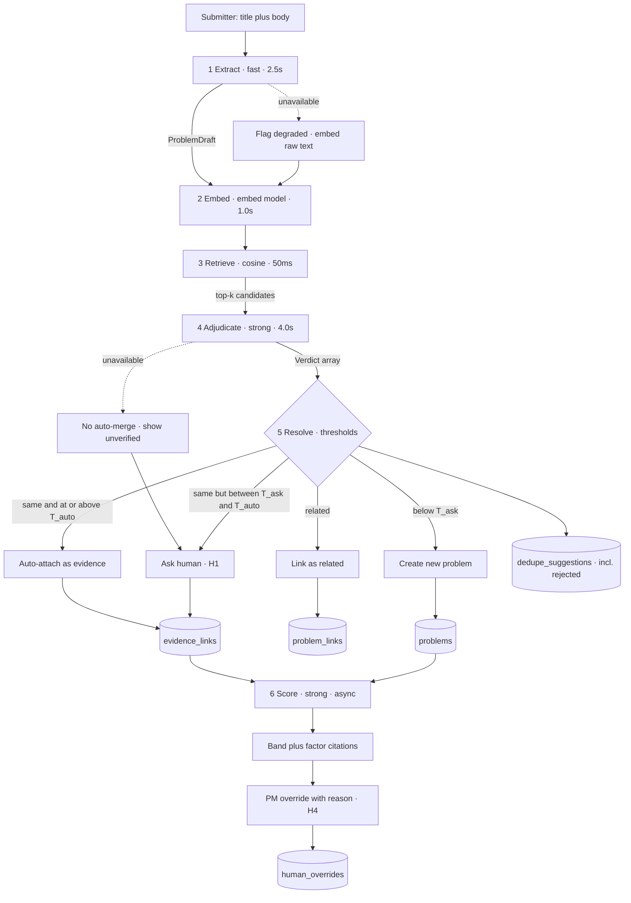

# Feature Intelligence System

Turns unstructured feature requests into **evidence about problems**, not votes on solutions.

Runs with **no API key** — the keyless path replays real recorded Gemini output, so the semantic
matching a reviewer sees is genuine. → [**Setup**](#setup) · [Demo script](docs/DEMO.md) ·
[Measurements](docs/eval-results.md)

---

## The problem

Product teams can see **how many people asked for something**. They cannot see **what problem
those people share**.

Requests arrive solution-shaped ("add a CSV export button"), in each requester's vocabulary,
through channels that don't talk to each other. The same need enters as *N* unrelated records
whose only quantified signal is a vote count. One problem raised 40 times in 40 wordings presents
as 40 small asks and loses to one raised 12 times consistently — so teams **systematically
underweight their most widely-felt problems**.

The damage compounds *backwards*: ungrouped requests make triage manual → manual triage gets
dropped in a busy week → an aged, ungrouped queue leaves vote count as the only comparable number
→ popularity-driven decisions are hard to justify, so rationale goes unrecorded → requesters who
never hear back stop submitting. **Poor communication degrades the quality of future intake.**

### Who benefits

| | Who | What they get |
|---|---|---|
| **Primary** | **Product Manager** (decides) | A queue that shrinks at the source, and a ranking they can argue with instead of defend |
| **Secondary** | **CSM / AE / Support** (submits) | Value inside the same 60-second interaction: "this matches a problem 23 other customers have raised" |
| **Tertiary** | **Product leader** (reads) | *Why* the ranking is what it is, in one screen, without a walkthrough |

### The thesis

> **A feature request is not a unit of demand. It's a piece of evidence about demand.**

Votes on solutions aggregate the wrong object, and every downstream step inherits that error. So
the system de-duplicates on the AI-**extracted underlying problem** rather than raw wording, at
intake — the one moment deduplication is free, *before the record exists*.

Three consequences shaped everything else:

1. **Don't remove the vote — re-point it.** One click, attached to the *problem*. And a problem is
   always rendered alongside its **verbatim** evidence: the abstraction indexes the original text,
   never replaces it.
2. **Dedupe errors are asymmetric, so don't tune for balanced F1.** A **false merge** hides demand,
   is nearly undetectable afterwards, and silently corrupts every downstream score. A **false
   split** is visible as two suspiciously similar problems and is cheap to fix later. So: bias
   auto-merge for precision, route the uncertain band to a human, accept a higher miss rate, keep
   every merge reversible at evidence granularity.
3. **A weighted sum can launder judgement into false objectivity.** Replacing votes with weights
   invented in a meeting swaps one bad heuristic for a better-dressed one. So: bands over precise
   ranks, per-factor decomposition with citations, weights as a visible version-controlled
   artifact, and every override captured with its reason.

Full reasoning, including four challenges to this thesis: [`docs/PRODUCT.md`](docs/PRODUCT.md).

---

## What's built

Only shipped features are listed. Numbers are measured on the seeded corpus, not projected.

| | Capability | What's real |
|---|---|---|
| **C3** | **Duplicate resolution at intake** — the centerpiece | Extract → embed → retrieve → adjudicate → three-way resolve, streamed stage by stage. All three outcomes reachable: auto-attach (21), flagged for a PM (11), create-new (23). `related` is stored distinctly from an evidence attach |
| **C4** | **Problem as accumulated evidence** | Canonical statement + the three extraction fields, every piece of **verbatim** original text with its account, evidence strength as a distinct-account count, one-click "this affects us too", and un-merge that restores the request intact |
| **C5** | **Explainable priority** | Four factors with per-factor citations resolved to real request titles, weights from `config/weights.json` shown in the UI, output as a **band** (now/next/later/no), deterministic arithmetic, band override with a mandatory reason |
| **C2** | **Record/replay provider** | 248 committed fixtures of real Gemini output. The keyless path serves **56/56** real extractions and embeddings — `npm run verify:replay` fails loudly if anything would silently degrade |
| **C6** | **Labelled seed corpus** | 55 requests, 22 accounts, 12 ground-truth problems, **11 planted near-duplicate pairs in machine-verified disjoint vocabulary**, 3 related-but-distinct pairs. No labels in the database — problems are formed by the pipeline, never seeded |
| **C7** | **Offline eval harness** | Pairwise precision/recall vs. the labels over a 28-cell threshold grid, stage-1 recall ceiling reported separately, zero network calls. Rewrites the generated region of `docs/eval-results.md` |
| **C8** | **Instrumentation** | Every model call writes an `ai_decisions` row (stage, model, prompt version, latency, tokens). M1–M3 each computable by [one SQL query](#success-metrics) |

**Not built**, by design: no auth, no integrations, no customer-facing anything, no metrics
dashboard, no in-app weight editing, no fine-tuning. See
[Non-Goals](docs/PRODUCT.md#non-goals).

### The demo path

Four beats, ~5 minutes, scripted with the real numbers in [`docs/DEMO.md`](docs/DEMO.md):

1. **`/problems`** — 55 requests are not 55 asks. 23 problems, each backed by verbatim evidence in
   different vocabularies. Nobody labelled these.
2. **`/priority`** — popularity and value point in opposite directions. EU data residency bands
   `now` at **#1 of 23** on *three* accounts; notification scoping bands `no` at **#19** on
   *four*. The decomposition says why: `strategic_fit` 1.00 against 0.10.
3. **`/intake`** — type a request yourself. It auto-attaches to the right problem at cosine
   **0.822**, verdict `same`, confidence **0.99** — sharing **zero content words** with any of the
   seven requests already on it. Every lexical method returns nothing here.
4. **`npm run eval`** — 8 of 11 planted disjoint pairs caught; 0 of 3 adjacent pairs wrongly
   merged; auto-band precision **1.000**.

---

## Architecture

**Next.js 16 (App Router) + TypeScript · SQLite + Drizzle · Tailwind + shadcn/ui · Gemini via the
Vercel AI SDK.** Server Components for reads, Server Actions for writes, no separate API layer
(except the intake stream, which needs NDJSON).

| Doc | What it decides |
|---|---|
| [`docs/PRODUCT.md`](docs/PRODUCT.md) | Spec: problem, thesis, challenges, metrics, appetite, non-goals |
| [`docs/ARCHITECTURE.md`](docs/ARCHITECTURE.md) | Components, 10-table data model, the 6-stage pipeline with per-stage budgets and fallbacks, threshold selection, untrusted-input handling |
| [`docs/TASKS.md`](docs/TASKS.md) | C1–C8 with acceptance criteria, actual times, and **the deviation record for every task** |
| [`docs/eval-results.md`](docs/eval-results.md) | Every measurement, with its date and basis. The figures in it are generated by the harness, not typed |
| [`docs/DEMO.md`](docs/DEMO.md) | The 5-minute script, and what to say about the limits |
| [`docs/DESIGN.md`](docs/DESIGN.md) | The interface direction the demo screens are cut against: the projected-board constraint, the band ladder, and why amber is reserved |
| [ADR 0001](docs/adr/0001-llm-provider.md) | Gemini via the Vercel AI SDK — chosen on budget, with three amendments recording what the free tier actually did |
| [ADR 0002](docs/adr/0002-two-stage-dedupe.md) | Two-stage dedupe: embedding recall → LLM adjudication. Amended once the premise was measured |
| [ADR 0003](docs/adr/0003-brute-force-cosine.md) | Brute-force cosine in SQLite, with two named scaling triggers |
| [ADR 0004](docs/adr/0004-record-replay-provider.md) | Record/replay for the keyless path — supersedes a synthetic mock |
| [ADR 0005](docs/adr/0005-duplicate-resolution-actor.md) | Who resolves a duplicate: confidence-banded, with a submitter escape hatch |

### Intake flow



Measured intake p95 ≈ 7.6s against the submitter's 60-second attention budget. Stage 6 (scoring)
is deliberately **off** the intake path — nobody waits 8s to file a request.

### The AI architecture, and why

**Two stages, because one is measurably not enough.**

Stage 1 embeds the extracted problem and does brute-force cosine over existing problem vectors —
cheap, generous recall. Stage 2 is one LLM call adjudicating all candidates together, returning
`same | related | distinct` with a confidence and a rationale per candidate.

The reason stage 2 is load-bearing rather than a refinement is the single most important number in
the project. On this corpus, **duplicates and adjacent problems overlap in cosine space**:

| set | n | mean | extreme |
|---|---|---|---|
| planted duplicates (same problem, no shared words) | 11 | 0.812 | **min 0.741** |
| related-but-distinct (adjacent problems) | 3 | 0.723 | **max 0.772** |

Separation: **−0.031**. The *worst* true duplicate scores **lower** than the *best*
adjacent-but-distinct pair. Re-measured over all 821 labelled (request, problem) tuples the
overlap is wider still: **−0.107**. So **no single cosine threshold separates the two classes** — a
cut at 0.75 would merge "ledger re-entry" with "dimensional reporting" (a false merge, the
expensive error) *and still miss* "SSO/SCIM" against "offboarding is a security risk".

Two design consequences follow, and both are measurements rather than preferences:

- **Problem formation follows the adjudicator's verdict, not a similarity threshold.** The
  thresholds govern how much human oversight a merge gets; they do not decide whether two problems
  are the same.
- **`T_auto` is a cosine cut in disguise.** `autoScore` is `min(confidence, similarity)`, and
  across all 37 `same` verdicts similarity is the binding term **37 times** (confidence 0.850–1.000
  vs. similarity 0.741–0.915). The two-axis sweep the plan described is one axis in practice.

**Deterministic code does all arithmetic.** AI estimates factors from prose; `src/scoring/score.ts`
is pure functions with 25 tests. Editing `config/weights.json` re-bands every problem immediately
with no model call.

**Untrusted input.** Request text reaches a prompt that drives a merge decision, so: structured
output only (`generateObject` + Zod at every call site), request text in a user-content block and
never concatenated into instructions, model output treated as data and never as control flow, no
tool calling, and a schema violation or unknown enum resolving to `distinct` — the non-destructive
outcome.

### Record / replay

A record script runs the real Gemini provider once over the corpus, capturing outputs into
committed JSON keyed by `sha256(stage + model_id + prompt_version + normalized_input)`. The replay
provider serves those fixtures, so **with no API key the full pipeline runs on real model
outputs** — genuine semantic matching, deterministic, offline, free.

The original plan was a deterministic mock using hashed character n-grams. **That design fails the
product**: n-gram similarity cannot match "add CSV export" to "finance can't get the numbers into
Excel", so the keyless path — the one most likely to be exercised — would have failed on exactly
the planted duplicates that exist to prove the thesis, demonstrating the *opposite* of the central
claim ([ADR 0004](docs/adr/0004-record-replay-provider.md)).

The prompt's **content hash** is in every fixture key, so editing a prompt in `/prompts`
invalidates its fixtures automatically: staleness is detected, not merely documented. Secondary
benefit: the eval is reproducible, so precision/recall doesn't drift between runs on model
nondeterminism.

**Limitation, labelled rather than hidden:** fixtures cover the corpus and the scripted demo
request. Free-typed novel input falls back to n-grams and **will** miss paraphrases with disjoint
vocabulary — the capability's own headline case. The UI marks that path as degraded. Full
capability needs an API key; the free tier suffices.

### Why Gemini — candidly

Chosen on **budget, not capability**. There is no API budget for this build and a reviewer must be
able to run it for free.

- **Claude** is likely the better adjudicator, but has no free API tier and **no first-party
  embeddings endpoint**, so stage 2 would need a second provider and still cost money.
- **OpenAI** is paid only. **Ollama / local weights** are free but hardware-dependent and
  gigabytes to pull, defeating zero-friction setup. **Free aggregator pools** are too volatile for
  a reproducible demo.

Choosing on budget means **adjudication quality was never benchmarked across providers.** The AI
SDK keeps the swap cost at one file if that constraint lifts.

Then the free tier taught three things the documentation does not publish. All three are recorded
as amendments to [ADR 0001](docs/adr/0001-llm-provider.md) because each changed the build:

1. **The cap is 20 `generate_content` requests per *day*, per model** — not per minute. Measured:
   the error stated the number, and `gemini-3.8-flash` was exhausted after 7 extractions with a
   stated retry-after of **19h21m**. A per-minute throttle is the wrong instrument against a daily
   cap; only reducing total calls or switching bucket helps. *Self-inflicted amplifier:* the AI SDK
   retries internally (3) and the record script retried on top (4), so one logical call could cost
   **12 real ones**. SDK retries are now off at every call site and retrying lives in one place.
2. **A failed call is still a billed call.** `gemini-3.8-flash` began returning intermittent 503
   "high demand", and of roughly 18 requests billed that day **exactly one produced output**. A 503
   carries no retry-after, so it is classified transient and gets the full backoff — four billed
   attempts, no result. The policy was *not* tuned blind (it can't be tested without a live
   overloaded model); what shipped instead is `npm run score -- --probe`, which spends **one** call
   with no retry to answer "is this bucket usable right now?".
3. **Model tiering is a quota strategy, not a quality strategy.** Each stage gets its own model so
   no two `generate_content` stages share a daily cap, and `renderBudget()` **verifies** that
   rather than asserting it — it immediately caught two stages silently falling back to the same
   tier. Embeddings are batched 16-per-call (56 calls → 4); **extraction is deliberately not
   batched**, because a model seeing several requests at once could normalise their statements
   toward each other and manufacture the very similarity the dedupe eval exists to measure.

The cost is recorded as a [known gap](#known-gaps): factor scoring ended up on the lite model.

---

## Where humans stay in the loop

Six points. Four are live in the UI, H3 ships its logic without its screen, and H6 is deliberately
out of core. A false merge is the error class the product cannot detect on its own, so the escape
hatch is load-bearing: it converts a false merge from invisible to self-reporting, and generates
labelled disagreement data for free.

| | Point | Where it lives |
|---|---|---|
| **H1** | Resolve a duplicate suggestion in the uncertain band — or say *"actually, mine is different"*, which creates a new problem and **records the disagreement** rather than burying it | `/intake` ([ADR 0005](docs/adr/0005-duplicate-resolution-actor.md)) |
| **H2** | Un-merge / re-parent evidence. Flips a flag, deletes nothing; the request reappears with its verbatim text, one click from re-attaching | `/problems/[id]` · `/review` |
| **H3** | Edit a canonical problem statement | Logic shipped, UI is the first cut ([E1](docs/TASKS.md#e1--ui-polish-of-the-demo-screens)) |
| **H4** | Override a priority band — **the reason is mandatory**, and refusing without one is the feature, not form validation | `/priority` |
| **H5** | Own the weights | `config/weights.json`, version-controlled |
| **H6** | Approve anything customer-facing | **Not in core.** Nothing leaves the system ([E2](docs/TASKS.md#e2--decision-brief--stakeholder-update)) |

Every attach below `T_auto` is persisted with `needs_review = true`, so the population a PM owes a
look is countable rather than invisible — 11 of 32 attaches on this corpus — and `/review` is where
that population gets worked: the verbatim request, the verdict and confidence behind the attach,
and confirm or reject ([E1](docs/TASKS.md#e1--ui-polish-of-the-demo-screens)). **Both** decisions
are recorded, because an override rate near zero would otherwise be indistinguishable from nobody
reviewing at all.

**An honest limit:** the seeded problem set is "what the adjudicator proposed", not "what a PM
approved". The canonical ingest pass ran with nobody present, so a flagged attach stands in for a
confirmation that never happened. That is why the headline precision number covers the **auto band
only**, where no human would have been asked.

---

## Success metrics

Each metric states what **this build** measures rather than borrowing production's authority.
Run any of them against the demo database by pasting the query in:

```bash
sqlite3 -header -column data/fis.db "<one of the queries below>"
```

### M1 — Dedupe precision / recall · *hard evidence*

Pre-registered before the run, so it couldn't be fitted after it: **precision ≥ 0.90** in the
auto-merge band, **recall ≥ 0.60** overall. Precision is the one that matters.

The labelled measurement is **not** a SQL query, deliberately: ground-truth labels are never loaded
into the database (a test parses `scripts/seed.ts` to enforce it), so the database cannot contain
the answers it is scored on. `npm run eval` holds the labels and reports
**precision 1.000 / recall 0.466**.

What SQL *does* answer is M1's production counterpart — precision as the running system reports it,
which is what you would watch once real humans are clicking:

```sql
SELECT
  CASE WHEN e.needs_review THEN 'flagged · a PM confirms' ELSE 'auto band · unattended' END AS band,
  COUNT(*)                                                           AS attaches,
  SUM(CASE WHEN e.active = 0 THEN 1 ELSE 0 END)                      AS undone_by_a_human,
  ROUND(1.0 * SUM(e.active) / COUNT(*), 3)                           AS precision_as_reported,
  ROUND(MIN(e.confidence), 3) || '–' || ROUND(MAX(e.confidence), 3)   AS score_range
FROM evidence_links e
WHERE e.created_by = 'ai' AND e.suggestion_id IS NOT NULL   -- attaches only, not new problems
GROUP BY band ORDER BY band;
```

```
band                     attaches  undone_by_a_human  precision_as_reported  score_range
auto band · unattended   21        0                  1.0                    0.802–0.915
flagged · a PM confirms  11        0                  1.0                    0.741–0.8
```

Un-merge one flagged attach in the UI and the flagged row drops to 0.909 while the auto band stays
1.000 — which is the point of banding at all. `dedupe_suggestions` retains **every** candidate
including the 733 rejected ones, which is what makes the counterfactual computable without a
separate experiment.

### M2 — Human adjudication load · *measurable now*

The share of submissions the pipeline resolves confidently vs. routes to a human, and how many
candidates a human must read to decide. This **replaces wall-clock "time to triage"**, which on
synthetic timestamps is a fabricated number that hedging doesn't rescue. Adjudication load is the
actual *mechanism* by which triage time falls, and it's real today.

```sql
SELECT
  CASE WHEN e.suggestion_id IS NULL THEN '3 · new problem · unattended'
       WHEN e.needs_review = 0      THEN '1 · auto-attached · unattended'
       ELSE                              '2 · attached · a PM must confirm' END AS outcome,
  COUNT(*) AS submissions,
  ROUND(100.0 * COUNT(*) / (SELECT COUNT(*) FROM requests WHERE triaged_at IS NOT NULL), 1) AS pct,
  ROUND(AVG((SELECT COUNT(*) FROM dedupe_suggestions d
             WHERE d.request_id = r.id)), 1)                        AS candidates_compared,
  ROUND(AVG((SELECT COUNT(*) FROM dedupe_suggestions d
             WHERE d.request_id = r.id AND d.verdict <> 'distinct')), 2) AS candidates_a_human_reads
FROM requests r JOIN evidence_links e ON e.request_id = r.id
WHERE r.triaged_at IS NOT NULL
GROUP BY outcome ORDER BY outcome;
```

```
outcome                           submissions  pct   candidates_compared  candidates_a_human_reads
1 · auto-attached · unattended    21           38.2  18.6                 1.9
2 · attached · a PM must confirm  11           20.0  16.1                 2.73
3 · new problem · unattended      23           41.8  11.0                 0.78
```

**80% of submissions resolve unattended; the 20% routed to a human cost ~2.7 candidates of reading
each.** (The harness quotes 34% review load on a different denominator — 11 of 32 *attaches* rather
than of 55 submissions. Both are stated where they're used.) *Production counterpart:*
`created_at → triaged_at` median and queue aging. The timestamps are instrumented so the metric is
computable from day one, but **no number is claimed from demo data.**

### M3 — PM override capture · *instrumentation only at this scale*

What ships is that every override is captured with suggested value, final value and reason in
append-only records, so suggested and final are both retained permanently.

```sql
SELECT o.target_type, o.field,
  COUNT(*)                                                            AS overrides,
  SUM(CASE WHEN TRIM(COALESCE(o.reason,'')) <> '' THEN 1 ELSE 0 END)   AS with_a_reason,
  SUM(CASE WHEN o.suggested_value IS NOT NULL
            AND o.final_value    IS NOT NULL THEN 1 ELSE 0 END)       AS both_values_kept,
  GROUP_CONCAT(o.suggested_value || ' → ' || o.final_value
               || '  (' || o.reason || ')', ' · ')                     AS what_changed_and_why
FROM human_overrides o
GROUP BY o.target_type, o.field;
```

On a freshly ingested database this returns **no rows**, and that is the honest answer: nothing is
pre-baked. Override a band or un-merge a piece of evidence in the UI, re-run, and the row appears:

```
target_type   field  overrides  with_a_reason  both_values_kept  what_changed_and_why
problem_band  band   1          1              1                 now → next  (ledger sync is already half-built, so it can wait a cycle)
```

**Honest limit:** with one person clicking through a demo, *n* ≈ 5. Any override *rate* from that
is noise, and reporting it as a result would be padding — so the query reports counts, not a rate.
*Production counterpart:* override rate as the real test of whether approval is meaningful. A
**near-zero** rate would mean the humans stopped thinking — a product failure reported as a
success. The recorded *reasons* are the highest-value artifact the system produces: the input to
weight tuning.

---

## Eval results

Full generated numbers, the 28-cell sweep and the hand-written analysis:
[`docs/eval-results.md`](docs/eval-results.md). Metric: **pairwise** over 1485 request pairs, 116
of which are true duplicates — for each pair, did the pipeline group them, and should it have?

### v1 → v2: the eval found a prompt defect, and fixing it improved both metrics

| metric | v1 | v2 (shipped) | |
|---|---|---|---|
| precision (all bands) | 0.974 | **1.000** | ↑ |
| recall | 0.319 | **0.466** | ↑ *(+46%)* |
| true merges | 37 | **54** | ↑ |
| **false merges** | 1 | **0** | ↓ |
| problems formed *(truth 12)* | 31 | **23** | ↓ |
| planted disjoint pairs caught | 6/11 | **8/11** | ↑ |
| adjacent pairs wrongly merged | 1/3 | **0/3** | ↓ |

The v1 eval showed all five missed pairs returning `related` at confidence **0.85** — not
`distinct`. The model recognised the shared problem and then split on *scope*. Two clauses in
`prompts/adjudicate.md` were responsible, and both were wrong on their own terms rather than merely
unlucky:

1. *"same cause, different scope"* in the `related` definition contradicted the definition it sat
   under — `related`'s primary test is "solving one would not resolve the other", and if the cause
   is the same then one fix resolves both. **"Scope" is also unbounded**: any two descriptions of
   one situation differ in scope at some zoom level, so the clause licensed arbitrary splitting.
2. *"when torn, answer `related`"* rested on a false premise — that a `same` verdict causes a silent
   merge. It doesn't; the system flags an uncertain `same` for a PM. So the prompt was guarding
   something already guarded, and the bias cost information that cannot be recovered downstream.

**That precision and recall moved together is the useful signal.** A prompt that splits genuine
duplicates on wording is not being *cautious* — it is being inaccurate, and it was getting the
adjacent pairs wrong too.

Also measured and reported separately, so a retrieval ceiling is never misread as an adjudication
failure: **stage-1 recall ceiling 1.000** at the shipped breadth (every candidate retrieved). Every
miss below is adjudication's, not retrieval's.

### Known gaps

Stated plainly, because a reviewer will find them and each one is recorded rather than discovered:

- **Recall 0.466 against a pre-registered ≥ 0.60.** Three planted pairs remain missed and 23
  problems formed where truth is 12, so the pipeline still **over-splits**. Shipped deliberately,
  not conceded: the asymmetry runs the other way for recall. A missed duplicate is a *false split*
  that a human sees and fixes; a false merge is invisible and corrupts every downstream score. This
  build protects the expensive side completely — **auto-band precision 1.000, zero false merges
  corpus-wide.** The visible cost is in demo Beat 2: notification scoping fragments across **four**
  problems instead of one, so the pipeline *understates* the reach of its most widely-felt problem.
  That is signal fragmentation — the exact failure this product exists to fix — visible in its own
  output.
- **`evidence_strength` contradicts its own definition — found, not fixed.** The architecture
  settles it as a **raw distinct-account count**, with ARR and segment reaching the score through
  `customer_value` alone, precisely so the same signal isn't counted twice. The model imports
  segment anyway: **0.90 for three enterprise accounts against 0.60 for four SMB accounts.**
  `prompts/factors.md` describes "independent corroboration" but never forbids weighting by *who*
  the accounts are, so the gap is in the prompt. Not fixed because editing it invalidates all 23
  fresh score fixtures and would show every problem as unscored until 6 more calls were spent; it
  changes **no band** on this corpus, since value and fit carry 0.70 of the weight. It was spotted
  only because the board prints the real account count beside the estimate — the mitigation
  working.
- **Factor scoring runs on the lite model, and nothing measures it.** Scoring was moved off the
  strong tier because 503s burned its daily cap. Factor estimation is the most judgement-heavy call
  in the system, so this is a real downgrade — and **there is no before/after**, because the strong
  tier produced one batch before its cap went. The eval harness measures *dedupe*, not scores. The
  mitigation is structural and predates the choice: estimates a PM overrides with a reason,
  PM-owned weights, raw account count printed beside every band.
- **`T_auto` 0.80 departs from the pre-registered selection rule.** The rule — *lowest `T_auto`
  whose auto-merge precision ≥ 0.90* — **degenerated**: v2 makes zero false merges at every
  operating point, so the constraint separated nothing and the rule's literal answer was the grid
  floor, i.e. *never ask a human*, which ADR 0005 exists to reject. The recall clause is
  simultaneously unsatisfiable. The harness reports the rule's literal output **and** that both
  clauses failed to bind, rather than quietly relaxing either. 0.80 is justified separately and
  from measurement: across all 821 labelled tuples, cosines between a request and a problem from a
  *different* true cluster reach **0.783**, so only above that line can an unattended merge land
  where no known non-duplicate also sits. 0.80 is the lowest grid point above it; 0.75 would
  auto-attach inside the contested band. The departure is recorded in `config/thresholds.json`
  itself, not just in prose.
- **The labels are mine.** I wrote the corpus and the ground truth, so the eval scores the pipeline
  against *my* notion of a duplicate on 55 items, with the threshold fitted on the data it is
  evaluated against. **Not external validation.** Its value is that the threshold is chosen by
  evidence rather than vibe, and that regressions become visible. Zero false merges in 32 attaches
  also only bounds the error rate at ~9% (95%, rule of three) — the 0.90 floor is *consistent with*
  the data, not certified by it.

---

## Assumptions, risks, tradeoffs

**Assumptions** — stated because two of them, if false, break the thesis rather than the build.

| | Assumption | If it's wrong |
|---|---|---|
| **A1** | A meaningful share of real intake is semantic duplicates. The seed assumes ~30% | Under ~10% true duplication, the centerpiece solves a small problem and focus should shift to explainable prioritisation |
| **A2** | Submitters accept "your request joined an existing problem" **if** they see their own words preserved | Untested, and the strongest counter-argument to the thesis. It's why verbatim text is never replaced, only indexed |
| **A3** | A PM engages with a factor decomposition rather than skipping to the number | Mitigated by showing bands, not precise scores |

**Risks.** Three are High: **over-abstraction** collapsing distinct problems into mega-themes
(*mitigation:* a rigid schema anchored on `current_workaround`, which is concrete by nature and
resists laddering); **false merges** hiding real demand undetectably (*mitigation:* threshold
chosen from the eval curve, human confirmation in the uncertain band, reversibility at evidence
granularity); and **appetite vs. ambition** (*mitigation:* a pre-committed cut order — one thing
excellent, the rest thin). Four more are Medium, including prompt injection via request text and
fixture staleness. Full table: [PRODUCT Appendix C](docs/PRODUCT.md#appendix-c--risk-table).

**Tradeoffs accepted.**

- **Precision over recall on merges** — the demo visibly misses some duplicates. Correct given the
  asymmetry, and stated out loud rather than hidden.
- **Brute-force cosine over a real index** — right at this scale (sub-millisecond), with two named
  scaling triggers: ~10k problems or p95 > 100ms for the index, and ~25 candidates per request for
  retrieval breadth, because the *adjudication prompt* becomes the binding constraint long before
  the cosine scan does.
- **Depth over surface area** — one capability that provably works over six that demo.
- **AI estimates, deterministic code computes** — more plumbing, for scores that are reproducible
  and auditable.
- **Fixtures over a synthetic mock** — a recording step and a staleness risk, for a keyless path
  that demonstrates the real capability instead of contradicting it.

### What I'd do next

In priority order. The first is not on the task list as a feature because it is a *measurement*
lever, and it is the most valuable hour available.

1. **The recall lever — tighten extraction, not adjudication.** v2's adjudication prompt now
   applies the causal test correctly on 8 of 11 pairs; the remaining misses arrive **already
   split**, because their *extracted statements* sit at different zoom levels before adjudication
   ever sees them. The fix is to constrain `currentWorkaround` to a concrete physical action, which
   is what stops a statement drifting up or down the zoom axis. **Its real cost is why it didn't
   happen:** that changes the extraction prompt's content hash, invalidating all 56 extractions,
   all 56 embeddings (they key on extracted text) and all 109 adjudications — ~165 fixtures against
   a daily cap still unmeasured on two of three models.
2. **[E1] UI polish** — the three intake outcomes visually distinct at a glance, the degraded-path
   label unmissable, the priority board legible when projected, empty states for a fresh database.
3. **[E2] Decision brief + stakeholder update** — generated from a problem's evidence, factors and
   override history, each grounded in the requester's own words. **Nothing sends**; no delivery path
   exists, by design.
4. **[E3] Review & hardening** — prove a prompt-injection attempt in request text cannot alter a
   merge or a score; concurrent submissions of the same problem don't double-create; the 503 retry
   policy the ADR declined to tune blind; the two documentation inaccuracies already logged
   (`fixtures/manifest.json` records the v1 adjudication prompt version; the record dry-run's
   bucket warning fires on a stage that is already fully recorded).
5. **[E4] CI gating** — tests and `eval` in replay mode with no key and no network, the eval
   **gating** the build rather than reporting, and fixture staleness failing CI rather than
   degrading silently.

---

## How this was built

**Spec-driven, in one direction:** `docs/PRODUCT.md` → `docs/ARCHITECTURE.md` + `docs/adr/` →
`docs/TASKS.md` → code. The rule that made it stick: **no code without a task ID.** New work became
a task first, every time.

**Per-task loop** (`CLAUDE.md`): explore → state a short plan → implement → **verify each
acceptance criterion individually** → commit. Definition of Done: all criteria checked; typecheck,
lint and tests pass; docs updated if a decision changed; `TASKS.md` updated with actual time and
**deviation from plan**; `prompts.txt` updated; committed.

**Eval-driven iteration.** Once the harness existed, *any* change to a prompt, threshold or model
required an eval run — a threshold changed without re-running the harness is a defect. That loop
closed once, visibly: the eval found a prompt defect, two clauses changed, 54 calls were
re-recorded, and precision and recall both improved. The "before" is kept in
`docs/eval-results.md` because deleting it would hide the only evidence that the loop works.

**AI collaboration is logged, not summarised.** Every prompt I sent is in
[`prompts.txt`](prompts.txt) **verbatim**, with a timestamp and what was done in response — 20
entries, including the corrections and the short follow-ups. It is the honest record of how the
work was directed, and the source of truth for elapsed time.

### Traceability: prompt → task ID → commit

Every commit is a conventional commit carrying its task ID, and **no commit mixes tasks**.

| `prompts.txt` entry | Task | Commit(s) |
|---|---|---|
| 1–2 · 02:51, 03:01 | project rules, prompt logging | `32ea434`, `96ca766` |
| 3–5 · 03:17, 03:22, 03:30 | spec + two skeptical review rounds | `3e22f25` |
| 6–7 · 03:35, 03:47 | plan, 5 ADRs, tasks, conventions | `5492b96`, `81971eb` |
| 8 · 03:50 | **C1** project skeleton | `9da13c3` |
| 9 · 04:05 | **C6** seed corpus | `72dfe92` |
| 10–11 · 04:20, 04:35 | **C2** provider abstraction, then recording | `14e7857`, `b1165be` |
| 12–13 · 05:13, 05:28 | **C3** retrieval plumbing, then the pipeline | `1ba7676`, `0c91f00` |
| 14–15 · 16:30, 16:52 | **C3** prompt v2 and close, after the eval diagnosis | `e38b64b`, `cb5f006`, `f49e867` |
| 16–17 · 17:02, 18:06 | **C7** eval harness · **C4** problem detail | `d7a2e7e`, `af688bc` |
| 18–19 · 18:28, 22:03 | **C5** explainable priority, then the bucket move | `cec65f4`, `0430a33` |
| 20 | **C8** this README + instrumentation | *(this commit)* |

Worked example of the chain: entry 14 asked for both prompt edits and a re-record → the work is
C3's acceptance criteria → commit `e38b64b` *"fix(C3): adjudication prompt v2 — recall 0.319 →
0.466, precision → 1.000"* → and the numbers in that subject line are reproducible with
`npm run eval`.

### Planned vs. actual

From `docs/TASKS.md`'s **Actual** fields and `prompts.txt` timestamps. **The build ran past its
cap**, and both the overrun and its causes are below rather than rounded away.

| Phase / task | Planned | Actual | |
|---|---|---|---|
| Project rules + verbatim prompt logging | — *(not in the appetite)* | ~22 min | |
| Spec — `PRODUCT.md`, two skeptical review rounds | ~40 min | ~23 min | ↓ |
| Plan — `ARCHITECTURE.md`, 5 ADRs, `TASKS.md`, conventions | ~20 min | ~14 min | ↓ |
| **C1** project skeleton | 25 min | ~10 min | ↓ scaffolding is largely generated |
| **C6** seed corpus with labels | 10 min | ~7 min | ↓ |
| **C2** provider + record/replay | 35 min | **~52 min** | ↑ quota archaeology |
| **C3** intake pipeline | 40 min | **~115 min** | ↑↑ eval-driven iteration + 2 recording runs |
| **C7** eval harness | 20 min | ~20 min | = |
| **C4** problem detail | 20 min | ~11 min | ↓ C3 had built most of the page |
| **C5** explainable priority | 25 min | **~31 min** | ↑ quota failure, then a bucket move |
| **C8** instrumentation + README | 5 min | **~40 min** | ↑↑ found and fixed the fresh-clone path |
| **Implementation subtotal** | **180 min** | **~286 min** | **+59%** |
| **Total incl. spec + plan** | **~240 min (the ~4h cap)** | **~345 min** | **~1h45m over** |

**Why it overran, specifically.** Three tasks account for all of it, and they overran for one
reason: **a measurement replaced an assumption, and the measurement was worth more than the
schedule.**

- **C2 (+17 min)** was ~8 minutes of code and ~44 minutes discovering the free tier's real shape.
  That overrun produced the 20/day cap finding, the nested-retry amplifier, and — most
  importantly — the **cosine overlap measurement** that reshaped ADR 0002 and settled whether
  problem formation could be threshold-driven. It could not.
- **C3 (+75 min)** includes one full eval-driven prompt iteration and two ~20-minute unattended
  recording runs. The iteration is the thing the whole methodology claims to do, so cutting it to
  protect the estimate would have been the wrong trade.
- **C8 (+35 min)** is this document plus the fresh-clone verification, which is where it earned its
  overrun: following the README from a clean clone with no `.env` **failed 56/56**. Fixture keys
  include the model id, and model ids came from the environment, so with nothing configured every
  lookup missed and the entire keyless demo silently degraded to n-grams — demonstrating the exact
  opposite of the central claim. Fixed by defaulting model ids to the committed `.env.example`
  template, which is where the architecture already said they live.

**Wall-clock elapsed is ~19.5 hours**, and that number is not working time: two long waits for a
daily API quota that resets once every 24 hours account for roughly 12 of them. The ~345 minutes
above is the sum of the recorded per-task actuals. `prompts.txt` timestamps are the source of
truth — minute-rounded, with commit times as the harder evidence. (One reconciliation: PRODUCT.md
says "this spec landed at ~40 minutes", counting from the start of the session — which includes the
project-rules row above. Prompt-to-commit for the spec alone is ~23 minutes.)

**The cap was fixed and scope was supposed to flex.** It did, in the places the cut order named:
`related` as a distinct outcome survived, but in-app weight editing, per-factor override, a
filtered PM review queue and all UI polish did not. What it did *not* do is cut the eval harness or
re-recording after a prompt fix — and that is the honest explanation for the overrun. Given the
choice between shipping on time with an unmeasured claim and shipping late with a measured one plus
a recorded gap, this build chose the second, every time.

---

## Setup

### Keyless quickstart — no API key, no network

Needs **Node 22+**; developed and verified on **Node 24.13 / npm 11.6**. `better-sqlite3` is a
native module but ships prebuilds, so there is nothing to compile.

```bash
npm install
npm run db:migrate      # creates ./data/fis.db — 10 tables
npm run seed            # 22 accounts, 55 requests, 0 problems (idempotent)
npm run verify:replay   # proves the keyless path: 56/56 real recorded outputs, 0 degraded
npm run ingest          # forms problems by running the pipeline — 0 API calls
npm run score           # factor estimates → bands — 0 API calls
npm run dev             # http://localhost:3000
```

**No `.env` required.** `AI_PROVIDER` defaults to `replay`, and model ids default to the committed
`.env.example` template — which matters because a fixture key includes the model id, so on the
replay path the *correct* id is the one the fixtures were recorded with.

Expected output, which also tells you nothing is silently degrading:

| step | expect |
|---|---|
| `verify:replay` | `real extractions: 56/56` · `real embeddings: 56/56` · `deterministic: yes` |
| `ingest` | `problems formed: 23` · `attached as evidence: 32 (11 flagged)` · `degraded: 0` |
| `score` | `score_runs written: 23` · `bands: now 10 · next 2 · later 4 · no 7` |
| `eval` *(optional)* | `precision 1.000 / recall 0.466` · `hard floor … PASS` |

Then follow [`docs/DEMO.md`](docs/DEMO.md). A **non-zero `degraded` count anywhere means stale
fixtures**, which `verify:replay` and `eval` both treat as a failure rather than a result.

### With a key — real semantic matching on free-typed input

Only needed to re-record fixtures, or to get genuine semantic matching on input outside the corpus.
Without a key, novel free-typed input falls back to n-gram similarity, **which will miss
paraphrases in disjoint vocabulary** — the capability's own headline case. The UI labels that path
as degraded rather than hiding it.

1. Get a **free** key at **[aistudio.google.com/apikey](https://aistudio.google.com/apikey)** —
   "Create API key", pick or create a project. No billing details required.
2. `cp .env.example .env`, then paste the key into `GOOGLE_GENERATIVE_AI_API_KEY=`. That exact
   name is what the AI SDK's Google provider reads by default, so the app never handles the value.
   `.env` is gitignored; `.env.example` is the only env file tracked, and it contains no key.
3. Set `AI_PROVIDER=gemini` only for the command you actually want to spend quota on. Leave it at
   `replay` the rest of the time.

**Mind the quota — it is the scarce resource here, not time or money.** The free tier allows
**20 `generate_content` requests per day, per model**, and a failed call still counts. So:

```bash
npm run record -- --dry-run    # ALWAYS first: prints the per-stage call count and budget table
npm run score  -- --probe      # spends exactly ONE call, no retry, to test a bucket
```

Recording is resumable — fixtures checkpoint per call and a re-run skips anything already recorded
by hash, so a run stopped by a daily cap resumes for free.

### Every npm script

| script | what it does | spends quota? |
|---|---|---|
| `npm run dev` | Next dev server on :3000 | no |
| `npm run build` · `start` | production build and serve | no |
| `npm test` | 202 Vitest tests | no |
| `npm run typecheck` · `lint` | `tsc --noEmit` · eslint | no |
| `npm run db:generate` | generate a Drizzle migration from the schema | no |
| `npm run db:migrate` | create / migrate `./data/fis.db` | no |
| `npm run seed` | accounts + raw requests only — **never problems or labels**, so the database can't contain the answers it's scored on | no |
| `npm run ingest` | the canonical pass: forms problems by running the pipeline over the corpus in a fixed order. `-- --dry-run`, `-- --limit=N` | only with `AI_PROVIDER=gemini` |
| `npm run score` | stage 6 — factor estimates, batched 4/call, into append-only `score_runs`. `-- --dry-run`, `-- --probe`, `-- --first=<ids>` | only with `AI_PROVIDER=gemini` |
| `npm run eval` | threshold sweep vs. the labels; rewrites the generated region of `docs/eval-results.md` | **never** — forces `replay` and replaces `fetch` with a thrower before any provider loads |
| `npm run verify:replay` | asserts the keyless path serves real recorded output for all 56 inputs; exits non-zero otherwise | no |
| `npm run record` | re-record extract + embed fixtures. **Run `-- --dry-run` first.** `-- --stage=<extract\|embed>` | **yes** |
| `npm run record:demo` | record the one scripted demo request's adjudication | **yes** |

### Layout

```
src/ai/         AiProvider interface · gemini · replay · fixtures · budget · retry · decision log
src/pipeline/   the 5 intake stages, retrieval, deterministic resolution, reset
src/scoring/    pure weighted-sum arithmetic + band mapping, append-only score runs
src/eval/       pairwise metrics, threshold sweep, report generation, v1 history
src/seed/       corpus, accounts, ground-truth labels, disjoint-vocabulary verifier
src/db/         Drizzle schema (10 tables), connections, in-memory db for tests
src/app/        App Router: / · /intake · /problems · /problems/[id] · /priority · /review
prompts/        versioned by content hash — editing one invalidates its fixtures
config/         weights.json · thresholds.json · strategy.json — PM-owned, version-controlled
fixtures/       248 committed real model outputs, keyed by input hash
```
