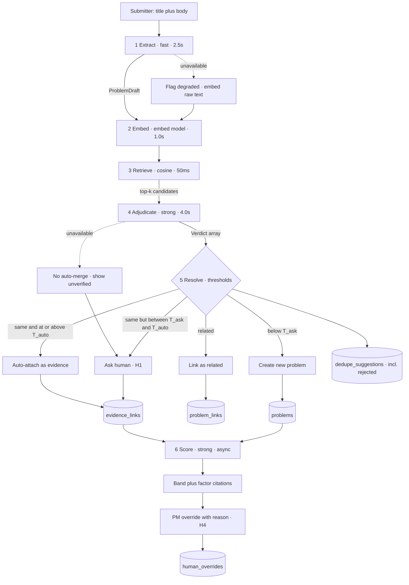

# Architecture

**Status:** plan (phase 2 of spec → plan → tasks → implementation)
**Upstream:** [`PRODUCT.md`](./PRODUCT.md) · **Decisions:** [`adr/`](./adr) · **Downstream:** [`TASKS.md`](./TASKS.md)

Scope discipline: this document covers only what the ~3h core ([C1–C8](./TASKS.md)) needs. Extensions are named, not designed.

---

## Components

| Layer | Path | Responsibility |
|---|---|---|
| UI | `app/` | App Router pages: intake, problem list, problem detail, priority board. Server Components for reads, Server Actions for writes — no separate API layer. |
| Pipeline | `lib/pipeline/` | Orchestrates the five intake stages. The only place stages are sequenced. |
| AI providers | `lib/ai/` | `AiProvider` interface — `extractProblem`, `embed`, `adjudicate`, `estimateFactors`. Implementations: `gemini`, `replay`. See [ADR 0001](./adr/0001-llm-provider.md), [0004](./adr/0004-record-replay-provider.md). |
| Retrieval | `lib/retrieval/` | Brute-force cosine over problem embeddings. [ADR 0003](./adr/0003-brute-force-cosine.md) |
| Scoring | `lib/scoring/` | Deterministic weighted sum + band mapping. Weights in `config/weights.json`. |
| Eval | `lib/eval/` | CLI harness: pipeline vs. labels → precision/recall per threshold. |
| Data | `db/` | Drizzle schema, migrations, seed + labels. |
| Fixtures | `fixtures/` | Committed recorded model outputs, keyed by input hash. |

**Model IDs live in `.env.example`, never in code** — `GEMINI_MODEL_FAST`, `GEMINI_MODEL_STRONG`, `GEMINI_MODEL_EMBED`, `EMBED_DIM`.

---

## Data Model

Drizzle + SQLite. Append-only tables are never updated in place — history is the product.

| Table | Key fields | Notes |
|---|---|---|
| `accounts` | `name`, `segment` (enterprise/mid/smb), `arr_cents`, `renewal_date` | Supplies customer-value context. |
| `requests` | `title`, `body_raw`, `submitter_kind` (customer/prospect/support/internal), `source` (csm_note/ae_note/support_ticket/internal/customer_direct), `account_id`, `created_at`, `triaged_at`, `resolution` (attached/related/created), `degraded` | **`body_raw` is immutable and verbatim.** The abstraction indexes it, never replaces it (PRODUCT challenge #1). `source` is distinct from `submitter_kind`: a CSM's third-person note and the customer's own first-person words are both `customer`, but they read very differently and the extractor prompt needs to know whose voice it has. |
| `problems` | `statement`, `job_to_be_done`, `current_workaround`, `blocked_outcome`, `embedding` (BLOB f32), `embedding_model`, `merged_into_id` | `merged_into_id` makes problem-level merges reversible. `embedding_model` is required because a model change invalidates stored vectors — without it, mixed-model cosine comparisons would silently return nonsense. |
| `evidence_links` | `request_id`, `problem_id`, `created_by` (ai/human), `confidence`, `suggestion_id`, `active` | **Reversibility unit.** Un-merge flips `active`; nothing is deleted. |
| `problem_links` | `problem_a_id`, `problem_b_id`, `kind` (`related`) | Keeps "same problem, different scope" as distinct information. |
| `supports` | `problem_id`, `account_id`, `actor` — unique on (problem, account) | The re-pointed vote: one click, attached to a problem. |
| `ai_decisions` | `stage`, `provider`, `model_id`, `prompt_version`, `input_hash`, `output_json`, `confidence`, `latency_ms`, `tokens`, `request_id`, `problem_id`, `created_at` | Audit log for **every** model call. Makes any AI output traceable after the fact — including *which prompt version* produced it. The nullable subject refs answer "which calls produced this problem's score?", which `input_hash` alone cannot. |
| `dedupe_suggestions` | `request_id`, `candidate_problem_id`, `similarity`, `verdict`, `verdict_confidence`, `rationale`, `human_action` (auto/accepted/related/rejected/unsure), `acted_at` | Powers **M1**. Rejected suggestions are retained — that's what makes the counterfactual computable. `verdict_confidence` is stored separately from `similarity` because threshold selection sweeps *both* axes; `unsure` is the [ADR 0005](./adr/0005-duplicate-resolution-actor.md) submitter path. |
| `human_overrides` | `target_type`, `target_id`, `field`, `suggested_value`, `final_value`, `reason`, `actor` | Append-only. Powers **M3**; suggested and final both retained forever. |
| `score_runs` | `problem_id`, `weights_version`, `factors_json` (with evidence-id citations), `raw_score`, `band`, `confidence`, `model_id` | Append-only. A re-score adds a row; it never overwrites one. |

**Resolves PRODUCT open question 2:** `evidence_strength` is a **raw count of distinct accounts**, not ARR-weighted. ARR and segment enter through the `customer_value` factor only — weighting both would double-count the same signal and make the score's most gameable input also its least visible.

---

## Pipeline

| # | Stage | Input | Output (Zod-validated) | Tier | Budget | Fallback on failure |
|---|---|---|---|---|---|---|
| 1 | **Extract** | `title` + `body_raw` (untrusted) | `ProblemDraft { job_to_be_done, current_workaround, blocked_outcome, confidence }` | fast | 2.5s | Embed raw text instead; set `degraded`; route to human |
| 2 | **Embed** | canonicalized draft string | `Float32Array[EMBED_DIM]` | embed | 1.0s | Hashed char n-gram vector; set `degraded`; label in UI |
| 3 | **Retrieve** | query vector + all problem vectors | top-*k* (k=8) with cosine | — *(deterministic)* | 50ms | None needed — in-process |
| 4 | **Adjudicate** | draft + *k* candidate statements | `Verdict[] { problem_id, relation: same\|related\|distinct, confidence, rationale }` | strong | 4.0s | **No auto-merge.** Show top-*k* by cosine as "unverified"; human decides |
| 5 | **Resolve** | verdicts + similarities + thresholds | one of: auto-attach / ask / link-related / create-new | — *(deterministic)* | 10ms | Safe default is always **create new**, never merge |
| 6 | **Score** *(async, off the intake path)* | problem + active evidence + accounts + strategy text | `Factors { customer_value, strategic_fit, evidence_strength, effort, citations[], confidence }` | strong | 8.0s | Retain last `score_run`, mark stale |

**Intake p95 ≈ 7.6s** against the submitter's 60-second attention budget ([PRODUCT](./PRODUCT.md#target-users--usage-scene)). Comfortable, but the UI streams stage-by-stage progress rather than showing one spinner — a silent 7s read as a hang is the same failure as a timeout.

Stage 6 is deliberately **not** on the intake path: it needs the evidence set that stage 5 just changed, and nobody waits 8s to file a request.

### Choosing thresholds from the eval

Two thresholds govern stage 5: `T_auto` (auto-attach) and `T_ask` (show as candidate at all). Both live in `config/thresholds.json`, not as code constants.

The harness sweeps cosine similarity × verdict confidence over the labeled seed and emits precision/recall for each pair. Selection rule, fixed in advance: **the lowest `T_auto` whose auto-merge precision ≥ 0.90**, then the lowest `T_ask` keeping recall ≥ 0.60. The chosen values, the curve they came from, and the date are written to `docs/eval-results.md`. Changing a threshold without re-running the harness is a defect.

**Resolves PRODUCT open question 3:** the harness **reports** in the core build and exits non-zero only below a hard floor (precision < 0.75), so a mid-build regression is loud but a borderline run doesn't block. Full gating is deferred to [E4](./TASKS.md).

### Safety — request text is untrusted data

Request text reaches a prompt that drives a merge decision, so it is treated as hostile input throughout.

- **Structured output only.** Every call uses `generateObject` with a Zod schema. Free text cannot become control flow.
- **Delimited placement.** Request text goes in a user-content block, never concatenated into the instruction section.
- **Output is data, never instruction.** No tool calling, no model-initiated writes, no code path selected by a model-supplied name. The model proposes; deterministic code writes.
- **Safe default on anything unexpected.** Schema violation, unknown enum value, or low confidence all resolve to `distinct` — the non-destructive outcome, per the error asymmetry in PRODUCT challenge #3.
- **`body_raw` is immutable and rendered escaped.** Detecting injection attempts is out of scope; the mitigation is structural, not detective.

### Human-in-the-loop points

| | Point | Where |
|---|---|---|
| **H1** | Resolve a duplicate suggestion in the uncertain band | Intake — [ADR 0005](./adr/0005-duplicate-resolution-actor.md) |
| **H2** | Un-merge / re-parent evidence | Problem detail (flips `evidence_links.active`) |
| **H3** | Edit a canonical problem statement | Problem detail (logic in core; UI is first cut) |
| **H4** | Override a priority band or factor, with a reason | Priority board (append-only) |
| **H5** | Own the weights | `config/weights.json`, version-controlled ([D6](./PRODUCT.md#recorded-decisions)) |
| **H6** | Approve anything customer-facing | Not in core — nothing leaves the system ([E2](./TASKS.md)) |

---

## Intake Flow

---

## Deferred

- **PROD open question 1** → resolved in [ADR 0005](./adr/0005-duplicate-resolution-actor.md).
- Vector index (`sqlite-vec` / pgvector) → [ADR 0003](./adr/0003-brute-force-cosine.md) names the trigger.
- Metrics dashboard, decision briefs, CI gating, re-clustering → [TASKS.md](./TASKS.md) E1–E4.
